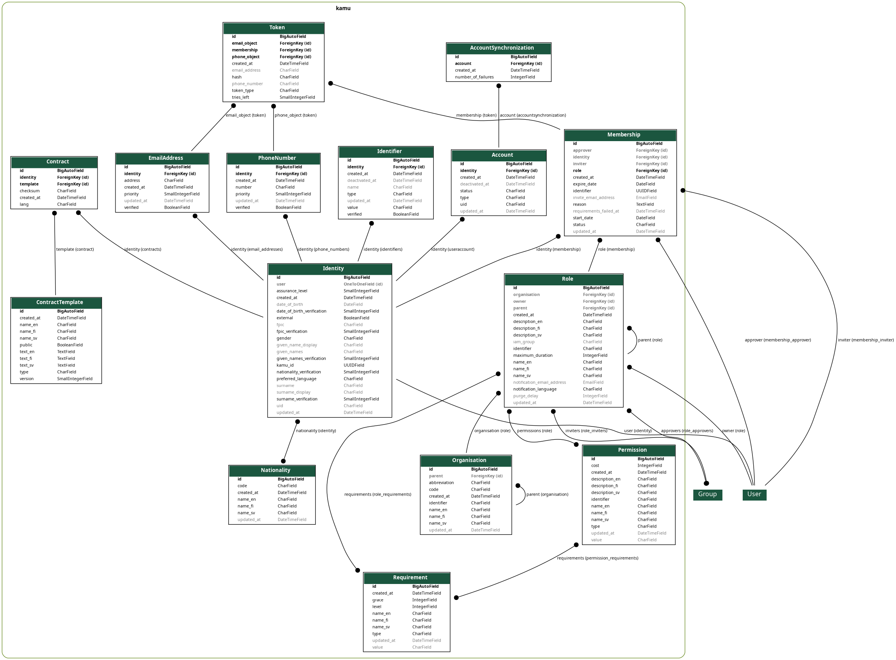

Models
======

   Database structural image

Account
--------
.. automodule:: kamu.models.account
    :members:

Identity
--------
.. automodule:: kamu.models.identity
    :members:

Membership
----------
.. automodule:: kamu.models.membership
    :members:

Role
----
.. automodule:: kamu.models.role
    :members:

Contract
--------
.. automodule:: kamu.models.contract
    :members:

Token
-----
.. automodule:: kamu.models.token
    :members:
